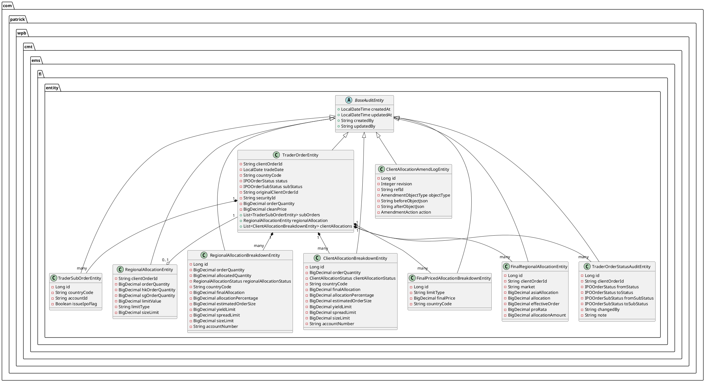
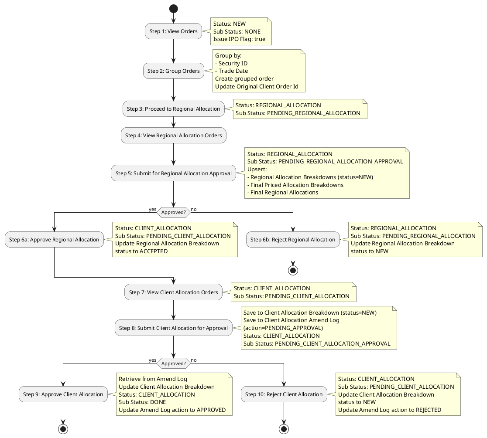
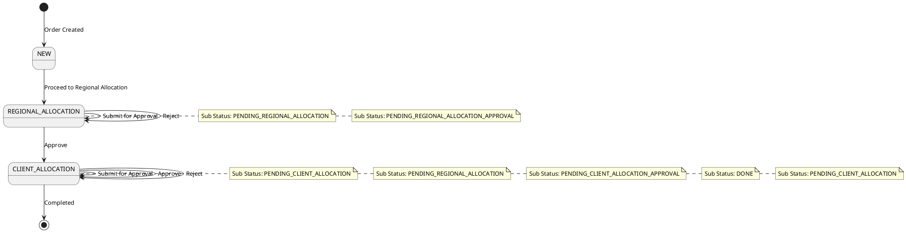

# Fixed Income IPO Order Allocation - Technical Documentation

## Table of Contents
1. [Overview](#overview)
2. [Architecture](#architecture)
3. [Database Design](#database-design)
4. [Class Diagram](#class-diagram)
5. [Process Flow](#process-flow)
6. [API Documentation](#api-documentation)
7. [Entity Relationships](#entity-relationships)
8. [Status Transitions](#status-transitions)

---

## Overview

### Project Description
The Fixed Income IPO Order Allocation system enables users to group and allocate IPO orders across Hong Kong (HK) and Singapore (SG) markets. The system provides a comprehensive workflow for order collection, regional allocation, and client allocation with approval mechanisms.

### Key Features
- **Order Grouping**: Group orders by security ID and trade date
- **Regional Allocation**: Allocate orders across HK and SG regions
- **Client Allocation**: Fine-tune allocations at the client level
- **Approval Workflow**: Multi-step approval process with audit trails
- **Amendment Tracking**: Track all changes with before/after snapshots

### Technology Stack
- **Framework**: Spring Boot 3.x
- **Language**: Java 17
- **Database**: PostgreSQL
- **ORM**: JPA/Hibernate
- **Migration Tool**: Liquibase (XML format)
- **Build Tool**: Maven

---

## Architecture

### System Architecture

```
┌─────────────────────────────────────────────────────────────┐
│                      Presentation Layer                      │
│                  (REST Controllers)                          │
├─────────────────────────────────────────────────────────────┤
│  OrderCollectionController  │  RegionalAllocationController  │
│  ClientAllocationController                                  │
└─────────────────────────────────────────────────────────────┘
                            │
┌─────────────────────────────────────────────────────────────┐
│                      Service Layer                           │
├─────────────────────────────────────────────────────────────┤
│  TraderOrderService      │  RegionalAllocationService       │
│  ClientAllocationService │  StatusService                   │
│  AmendLogService                                             │
└─────────────────────────────────────────────────────────────┘
                            │
┌─────────────────────────────────────────────────────────────┐
│                      Repository Layer                        │
│                    (JPA Repositories)                         │
└─────────────────────────────────────────────────────────────┘
                            │
┌─────────────────────────────────────────────────────────────┐
│                      Database Layer                          │
│                      PostgreSQL                              │
└─────────────────────────────────────────────────────────────┘
```

### Package Structure
```
com.patrick.wpb.cmt.ems.fi
├── controller/          # REST API Controllers
├── service/            # Business Logic Services
├── entity/             # JPA Entities
├── repo/               # JPA Repositories
├── dto/                # Data Transfer Objects
└── enums/              # Enumerations
```

---

## Database Design

### Entity Relationship Diagram

```plantuml
@startuml Database ERD
!define TABLE(name,desc) class name as "desc" << (T,#FFAAAA) >>
!define PK(x) <b>PK</b> x
!define FK(x) <i>FK</b> x

TABLE(trader_order, "Trader Order") {
  PK(client_order_id) : VARCHAR(64)
  trade_date : DATE
  country_code : VARCHAR(8)
  status : VARCHAR(32)
  sub_status : VARCHAR(64)
  original_client_order_id : VARCHAR(64)
  security_id : VARCHAR(64)
  order_quantity : NUMERIC(20,4)
  clean_price : NUMERIC(18,6)
  created_at : TIMESTAMP
  updated_at : TIMESTAMP
  created_by : VARCHAR(64)
  updated_by : VARCHAR(64)
}

TABLE(trader_sub_order, "Trader Sub Order") {
  PK(id) : BIGSERIAL
  FK(client_order_id) : VARCHAR(64)
  country_code : VARCHAR(8)
  account_id : VARCHAR(64)
  issue_ipo_flag : BOOLEAN
  created_at : TIMESTAMP
  updated_at : TIMESTAMP
}

TABLE(regional_allocation, "Regional Allocation") {
  PK(client_order_id) : VARCHAR(64)
  order_quantity : NUMERIC(20,4)
  hk_order_quantity : NUMERIC(20,4)
  sg_order_quantity : NUMERIC(20,4)
  limit_value : NUMERIC(20,4)
  limit_type : VARCHAR(32)
  size_limit : NUMERIC(20,4)
  created_at : TIMESTAMP
  updated_at : TIMESTAMP
  created_by : VARCHAR(64)
  updated_by : VARCHAR(64)
}

TABLE(regional_allocation_breakdown, "Regional Allocation Breakdown") {
  PK(id) : BIGSERIAL
  FK(client_order_id) : VARCHAR(64)
  order_quantity : NUMERIC(20,4)
  allocated_quantity : NUMERIC(20,4)
  regional_allocation_status : VARCHAR(16)
  country_code : VARCHAR(8)
  final_allocation : NUMERIC(20,4)
  allocation_percentage : NUMERIC(7,4)
  estimated_order_size : NUMERIC(20,4)
  yield_limit : NUMERIC(9,4)
  spread_limit : NUMERIC(9,4)
  size_limit : NUMERIC(20,4)
  account_number : VARCHAR(64)
  created_at : TIMESTAMP
  updated_at : TIMESTAMP
  created_by : VARCHAR(64)
  updated_by : VARCHAR(64)
}

TABLE(client_allocation_breakdown, "Client Allocation Breakdown") {
  PK(id) : BIGSERIAL
  FK(client_order_id) : VARCHAR(64)
  order_quantity : NUMERIC(20,4)
  client_allocation_status : VARCHAR(16)
  country_code : VARCHAR(8)
  final_allocation : NUMERIC(20,4)
  allocation_percentage : NUMERIC(7,4)
  estimated_order_size : NUMERIC(20,4)
  yield_limit : NUMERIC(9,4)
  spread_limit : NUMERIC(9,4)
  size_limit : NUMERIC(20,4)
  account_number : VARCHAR(64)
  created_at : TIMESTAMP
  updated_at : TIMESTAMP
  created_by : VARCHAR(64)
  updated_by : VARCHAR(64)
}

TABLE(client_allocation_amend_log, "Client Allocation Amend Log") {
  PK(id) : BIGSERIAL
  revision : INTEGER
  ref_id : VARCHAR(64)
  obj_type : VARCHAR(32)
  before_obj_json : TEXT
  after_obj_json : TEXT
  action : VARCHAR(32)
  created_at : TIMESTAMP
  updated_at : TIMESTAMP
  created_by : VARCHAR(64)
  updated_by : VARCHAR(64)
}

TABLE(final_priced_allocation_breakdown, "Final Priced Allocation Breakdown") {
  PK(id) : BIGSERIAL
  FK(client_order_id) : VARCHAR(64)
  limit_type : VARCHAR(32)
  final_price : NUMERIC(18,6)
  country_code : VARCHAR(8)
  created_at : TIMESTAMP
  updated_at : TIMESTAMP
  created_by : VARCHAR(64)
  updated_by : VARCHAR(64)
}

TABLE(final_regional_allocation, "Final Regional Allocation") {
  PK(id) : BIGSERIAL
  FK(client_order_id) : VARCHAR(64)
  market : VARCHAR(32)
  asia_allocation : NUMERIC(20,4)
  allocation : NUMERIC(20,4)
  effective_order : NUMERIC(20,4)
  pro_rata : NUMERIC(7,4)
  allocation_amount : NUMERIC(20,4)
  created_at : TIMESTAMP
  updated_at : TIMESTAMP
  created_by : VARCHAR(64)
  updated_by : VARCHAR(64)
}

TABLE(trader_order_status_audit, "Trader Order Status Audit") {
  PK(id) : BIGSERIAL
  FK(client_order_id) : VARCHAR(64)
  from_status : VARCHAR(32)
  to_status : VARCHAR(32)
  from_sub_status : VARCHAR(64)
  to_sub_status : VARCHAR(64)
  changed_by : VARCHAR(64)
  note : TEXT
  created_at : TIMESTAMP
}

' Relationships
trader_order ||--o{ trader_sub_order : "has"
trader_order ||--o| regional_allocation : "has"
trader_order ||--o{ regional_allocation_breakdown : "has"
trader_order ||--o{ client_allocation_breakdown : "has"
trader_order ||--o{ final_priced_allocation_breakdown : "has"
trader_order ||--o{ final_regional_allocation : "has"
trader_order ||--o{ trader_order_status_audit : "has"

@enduml
```



### Table Descriptions

#### trader_order
Central table storing all trader orders with status and sub-status tracking.

**Key Fields:**
- `client_order_id` (PK): Unique identifier for the order
- `original_client_order_id`: Reference to original order when grouped
- `status`: Current order status (NEW, REGIONAL_ALLOCATION, CLIENT_ALLOCATION)
- `sub_status`: Current sub-status (NONE, PENDING_REGIONAL_ALLOCATION, etc.)

#### regional_allocation
Stores regional allocation summary for an order (HK and SG quantities).

**Key Fields:**
- `client_order_id` (PK, FK): References trader_order
- `hk_order_quantity`: Total HK order quantity
- `sg_order_quantity`: Total SG order quantity

#### regional_allocation_breakdown
Detailed breakdown of regional allocation by account and country.

**Key Fields:**
- `id` (PK): Auto-generated ID
- `client_order_id` (FK): References trader_order
- `allocated_quantity`: Quantity allocated to this breakdown
- `regional_allocation_status`: Status (NEW, ACCEPTED)

#### client_allocation_breakdown
Client-level allocation breakdown with final allocation quantities.

**Key Fields:**
- `id` (PK): Auto-generated ID
- `client_order_id` (FK): References trader_order
- `client_allocation_status`: Status (NEW, ACCEPTED)
- `final_allocation`: Final allocated quantity

#### client_allocation_amend_log
Audit trail for all client allocation amendments.

**Key Fields:**
- `id` (PK): Auto-generated ID
- `ref_id`: Reference to client_order_id
- `revision`: Revision number
- `before_obj_json`: JSON snapshot before change
- `after_obj_json`: JSON snapshot after change
- `action`: Action status (PENDING_APPROVAL, APPROVED, REJECTED)

#### final_priced_allocation_breakdown
Final pricing information by country.

**Key Fields:**
- `id` (PK): Auto-generated ID
- `client_order_id` (FK): References trader_order
- `country_code`: Country (HK, SG)
- `final_price`: Final price for allocation

#### final_regional_allocation
Final regional allocation details by market.

**Key Fields:**
- `id` (PK): Auto-generated ID
- `client_order_id` (FK): References trader_order
- `market`: Market identifier
- `allocation`: Allocation amount
- `pro_rata`: Pro-rata percentage

---

## Class Diagram

### Entity Classes



### Service Classes

```plantuml
@startuml Service Classes
package "com.patrick.wpb.cmt.ems.fi.service" {
  class StatusService {
    - List<StatusTransition> allowedTransitions
    + TraderOrderEntity updateStatus(String, IPOOrderStatus, IPOOrderSubStatus, String, String)
    - boolean isValidTransition(IPOOrderStatus, IPOOrderSubStatus, IPOOrderStatus, IPOOrderSubStatus)
    - void recordStatusChange(TraderOrderEntity, IPOOrderStatus, IPOOrderSubStatus, String, String)
  }

  class AmendLogService {
    + ClientAllocationAmendLogEntity recordAmendment(String, AmendmentObjectType, String, String, String)
    + void updateAction(String, AmendmentAction)
    + Optional<ClientAllocationAmendLogEntity> getLatestAmendment(String)
  }

  class TraderOrderService {
    + TraderOrderEntity groupOrders(List<String>, String, String)
    + TraderOrderEntity proceedToRegionalAllocation(String, String, String)
  }

  class RegionalAllocationService {
    + List<TraderOrderEntity> fetchRegionalAllocationOrders()
    + RegionalAllocationDetailDto getRegionalAllocationDetail(String)
    + RegionalAllocationEntity upsertAllocation(String, BigDecimal, BigDecimal, BigDecimal, String, BigDecimal)
    + TraderOrderEntity submitForApproval(String, List<RegionalAllocationBreakdownRequest>, List<FinalPricedAllocationBreakdownRequest>, List<FinalRegionalAllocationRequest>, String, String)
    + TraderOrderEntity approve(String, String, String)
    + TraderOrderEntity reject(String, String, String)
    - void upsertRegionalAllocationBreakdowns(TraderOrderEntity, List<RegionalAllocationBreakdownRequest>)
    - void upsertFinalPricedAllocationBreakdowns(TraderOrderEntity, List<FinalPricedAllocationBreakdownRequest>)
    - void upsertFinalRegionalAllocations(TraderOrderEntity, List<FinalRegionalAllocationRequest>)
  }

  class ClientAllocationService {
    + List<TraderOrderEntity> fetchPendingClientAllocations()
    + List<TraderOrderEntity> fetchPendingClientAllocationApprovals()
    + ClientAllocationDetailDto getClientAllocationDetail(String)
    + List<ClientAllocationBreakdownEntity> getBreakdowns(String)
    + List<ClientAllocationBreakdownEntity> saveDraftAllocations(String, List<ClientAllocationBreakdownRequest>)
    + TraderOrderEntity submitForApproval(String, List<ClientAllocationBreakdownRequest>, String, String)
    + TraderOrderEntity approve(String, String, String)
    + TraderOrderEntity reject(String, String, String)
    - void upsertClientAllocationBreakdowns(TraderOrderEntity, List<ClientAllocationBreakdownRequest>)
    - void applyApprovedBreakdowns(TraderOrderEntity, List<ClientAllocationBreakdownEntity>)
  }

  StatusService --> TraderOrderRepository
  StatusService --> TraderOrderStatusAuditRepository
  AmendLogService --> ClientAllocationAmendLogRepository
  TraderOrderService --> TraderOrderRepository
  TraderOrderService --> StatusService
  RegionalAllocationService --> RegionalAllocationRepository
  RegionalAllocationService --> RegionalAllocationBreakdownRepository
  RegionalAllocationService --> FinalPricedAllocationBreakdownRepository
  RegionalAllocationService --> FinalRegionalAllocationRepository
  RegionalAllocationService --> StatusService
  ClientAllocationService --> ClientAllocationBreakdownRepository
  ClientAllocationService --> ClientAllocationAmendLogRepository
  ClientAllocationService --> RegionalAllocationBreakdownRepository
  ClientAllocationService --> AmendLogService
  ClientAllocationService --> StatusService
}

@enduml
```



---

## Process Flow

### IPO Order Allocation Workflow



### Status Transition Diagram



---

## API Documentation

### Order Collection APIs

#### 1. Get Orders for Collection
**Endpoint:** `GET /api/orders/collection`

**Description:** Retrieve orders with status NEW, sub-status NONE, and Issue IPO Flag = true

**Response:**
```json
[
  {
    "clientOrderId": "ORDER-001",
    "tradeDate": "2024-01-15",
    "countryCode": "HK",
    "status": "NEW",
    "subStatus": "NONE",
    "securityId": "SEC-123",
    "orderQuantity": 1000.0000,
    "cleanPrice": 100.500000
  }
]
```

#### 2. Group Orders
**Endpoint:** `POST /api/orders/group`

**Request Body:**
```json
{
  "clientOrderIds": ["ORDER-001", "ORDER-002"],
  "changedBy": "user123",
  "note": "Grouping orders for IPO allocation"
}
```

**Response:**
```json
{
  "clientOrderId": "GROUP-ORDER-001",
  "orderQuantity": 2000.0000,
  "status": "NEW",
  "subStatus": "NONE"
}
```

#### 3. Proceed to Regional Allocation
**Endpoint:** `POST /api/orders/{clientOrderId}/proceed-to-regional-allocation`

**Request Body:**
```json
{
  "changedBy": "user123",
  "note": "Proceeding to regional allocation"
}
```

**Response:**
```json
{
  "clientOrderId": "GROUP-ORDER-001",
  "status": "REGIONAL_ALLOCATION",
  "subStatus": "PENDING_REGIONAL_ALLOCATION"
}
```

### Regional Allocation APIs

#### 4. Get Regional Allocation Orders
**Endpoint:** `GET /api/orders/regional-allocation`

**Description:** Retrieve all orders with status REGIONAL_ALLOCATION

**Response:** Array of TraderOrderSummaryDto

#### 5. Get Regional Allocation Detail
**Endpoint:** `GET /api/orders/{clientOrderId}/regional-allocation/detail`

**Description:** Get complete regional allocation details including breakdowns, priced allocations, and final regional allocations

**Response:**
```json
{
  "regionalAllocation": {
    "clientOrderId": "GROUP-ORDER-001",
    "orderQuantity": 2000.0000,
    "hkOrderQuantity": 1200.0000,
    "sgOrderQuantity": 800.0000,
    "limitValue": 5000.0000,
    "limitType": "YIELD",
    "sizeLimit": 3000.0000
  },
  "regionalAllocationBreakdowns": [
    {
      "id": 1,
      "countryCode": "HK",
      "accountNumber": "ACC-HK-001",
      "orderQuantity": 1200.0000,
      "allocatedQuantity": 1200.0000,
      "regionalAllocationStatus": "NEW",
      "finalAllocation": 1200.0000,
      "allocationPercentage": 60.0000
    }
  ],
  "finalPricedAllocationBreakdowns": [
    {
      "id": 1,
      "countryCode": "HK",
      "limitType": "YIELD",
      "finalPrice": 100.500000
    }
  ],
  "finalRegionalAllocations": [
    {
      "id": 1,
      "market": "HK",
      "asiaAllocation": 1200.0000,
      "allocation": 1200.0000,
      "effectiveOrder": 1200.0000,
      "proRata": 60.0000,
      "allocationAmount": 1200.0000
    }
  ]
}
```

#### 6. Upsert Regional Allocation
**Endpoint:** `PUT /api/orders/{clientOrderId}/regional-allocation`

**Request Body:**
```json
{
  "hkOrderQuantity": 1200.0000,
  "sgOrderQuantity": 800.0000,
  "limitValue": 5000.0000,
  "limitType": "YIELD",
  "sizeLimit": 3000.0000
}
```

#### 7. Submit Regional Allocation for Approval
**Endpoint:** `POST /api/orders/{clientOrderId}/regional-allocation/submit`

**Request Body:**
```json
{
  "regionalAllocationBreakdowns": [
    {
      "countryCode": "HK",
      "accountNumber": "ACC-HK-001",
      "orderQuantity": 1200.0000,
      "allocatedQuantity": 1200.0000,
      "finalAllocation": 1200.0000,
      "allocationPercentage": 60.0000
    }
  ],
  "finalPricedAllocationBreakdowns": [
    {
      "countryCode": "HK",
      "limitType": "YIELD",
      "finalPrice": 100.500000
    }
  ],
  "finalRegionalAllocations": [
    {
      "market": "HK",
      "asiaAllocation": 1200.0000,
      "allocation": 1200.0000,
      "effectiveOrder": 1200.0000,
      "proRata": 60.0000,
      "allocationAmount": 1200.0000
    }
  ],
  "changedBy": "user123",
  "note": "Submit for regional allocation approval"
}
```

#### 8. Approve Regional Allocation
**Endpoint:** `POST /api/orders/{clientOrderId}/regional-allocation/approve`

**Request Body:**
```json
{
  "changedBy": "approver123",
  "note": "Approved regional allocation"
}
```

#### 9. Reject Regional Allocation
**Endpoint:** `POST /api/orders/{clientOrderId}/regional-allocation/reject`

**Request Body:**
```json
{
  "changedBy": "approver123",
  "note": "Rejected regional allocation"
}
```

### Client Allocation APIs

#### 10. Get Pending Client Allocation Orders
**Endpoint:** `GET /api/orders/client-allocation`

**Description:** Retrieve orders with status CLIENT_ALLOCATION and sub-status PENDING_CLIENT_ALLOCATION

#### 11. Get Pending Client Allocation Approvals
**Endpoint:** `GET /api/orders/client-allocation/approvals`

**Description:** Retrieve orders pending approval (status CLIENT_ALLOCATION, sub-status PENDING_CLIENT_ALLOCATION_APPROVAL)

#### 12. Get Client Allocation Detail
**Endpoint:** `GET /api/orders/{clientOrderId}/client-allocation/detail`

**Description:** Get complete client allocation details including breakdowns, amend logs, and regional allocation summaries

**Response:**
```json
{
  "clientAllocationBreakdowns": [
    {
      "id": 1,
      "countryCode": "HK",
      "accountNumber": "ACC-HK-001",
      "orderQuantity": 1200.0000,
      "clientAllocationStatus": "NEW",
      "finalAllocation": 1100.0000,
      "allocationPercentage": 55.0000
    }
  ],
  "clientAllocationAmendLogs": [
    {
      "id": 1,
      "revision": 1,
      "refId": "GROUP-ORDER-001",
      "objectType": "CLIENT_ALLOCATION_BREAKDOWN",
      "beforeObjectJson": "{...}",
      "afterObjectJson": "{...}",
      "action": "PENDING_APPROVAL",
      "createdBy": "user123"
    }
  ],
  "regionalAllocationBreakdownSummaries": [
    {
      "countryCode": "HK",
      "totalOrderQuantity": 1200.0000,
      "totalAllocatedQuantity": 1200.0000
    },
    {
      "countryCode": "SG",
      "totalOrderQuantity": 800.0000,
      "totalAllocatedQuantity": 800.0000
    }
  ]
}
```

#### 13. Get Client Allocations
**Endpoint:** `GET /api/orders/{clientOrderId}/client-allocations`

**Description:** Get client allocation breakdowns for an order

#### 14. Save Draft Client Allocations
**Endpoint:** `PUT /api/orders/{clientOrderId}/client-allocations`

**Request Body:**
```json
{
  "breakdowns": [
    {
      "countryCode": "HK",
      "accountNumber": "ACC-HK-001",
      "orderQuantity": 1200.0000,
      "finalAllocation": 1100.0000,
      "allocationPercentage": 55.0000
    }
  ]
}
```

#### 15. Submit Client Allocation for Approval
**Endpoint:** `POST /api/orders/{clientOrderId}/client-allocations/submit`

**Request Body:**
```json
{
  "breakdowns": [
    {
      "countryCode": "HK",
      "accountNumber": "ACC-HK-001",
      "orderQuantity": 1200.0000,
      "finalAllocation": 1100.0000,
      "allocationPercentage": 55.0000
    }
  ],
  "changedBy": "user123",
  "note": "Submit for client allocation approval"
}
```

#### 16. Approve Client Allocation
**Endpoint:** `POST /api/orders/{clientOrderId}/client-allocations/approve`

**Request Body:**
```json
{
  "changedBy": "approver123",
  "note": "Approved client allocation"
}
```

#### 17. Reject Client Allocation
**Endpoint:** `POST /api/orders/{clientOrderId}/client-allocations/reject`

**Request Body:**
```json
{
  "changedBy": "approver123",
  "note": "Rejected client allocation"
}
```

---

## Entity Relationships

### Relationship Summary

1. **TraderOrderEntity** (1) → (N) **TraderSubOrderEntity**
   - One order can have multiple sub-orders
   - Foreign Key: `trader_sub_order.client_order_id` → `trader_order.client_order_id`

2. **TraderOrderEntity** (1) → (0..1) **RegionalAllocationEntity**
   - One-to-one relationship (optional)
   - Shared Primary Key: `client_order_id`

3. **TraderOrderEntity** (1) → (N) **RegionalAllocationBreakdownEntity**
   - One order can have multiple regional allocation breakdowns
   - Foreign Key: `regional_allocation_breakdown.client_order_id` → `trader_order.client_order_id`

4. **TraderOrderEntity** (1) → (N) **ClientAllocationBreakdownEntity**
   - One order can have multiple client allocation breakdowns
   - Foreign Key: `client_allocation_breakdown.client_order_id` → `trader_order.client_order_id`

5. **TraderOrderEntity** (1) → (N) **FinalPricedAllocationBreakdownEntity**
   - One order can have multiple final priced allocation breakdowns (one per country)
   - Foreign Key: `final_priced_allocation_breakdown.client_order_id` → `trader_order.client_order_id`

6. **TraderOrderEntity** (1) → (N) **FinalRegionalAllocationEntity**
   - One order can have multiple final regional allocations (one per market)
   - Foreign Key: `final_regional_allocation.client_order_id` → `trader_order.client_order_id`

7. **TraderOrderEntity** (1) → (N) **TraderOrderStatusAuditEntity**
   - One order can have multiple status audit records
   - Foreign Key: `trader_order_status_audit.client_order_id` → `trader_order.client_order_id`

8. **ClientAllocationAmendLogEntity** (N) → (1) **TraderOrderEntity** (by ref_id)
   - Multiple amend logs can reference one order
   - Reference: `client_allocation_amend_log.ref_id` → `trader_order.client_order_id`

### Foreign Key Constraints

All foreign keys are configured with `ON DELETE NO ACTION` to prevent accidental data loss and maintain referential integrity.

---

## Status Transitions

### IPOOrderStatus Enum
- `NEW`: Initial order status
- `REGIONAL_ALLOCATION`: Order is in regional allocation phase
- `CLIENT_ALLOCATION`: Order is in client allocation phase

### IPOOrderSubStatus Enum
- `NONE`: No sub-status
- `PENDING_REGIONAL_ALLOCATION`: Waiting for regional allocation
- `PENDING_REGIONAL_ALLOCATION_APPROVAL`: Regional allocation pending approval
- `PENDING_CLIENT_ALLOCATION`: Waiting for client allocation
- `PENDING_CLIENT_ALLOCATION_APPROVAL`: Client allocation pending approval
- `DONE`: Allocation completed

### RegionalAllocationStatus Enum
- `NEW`: New regional allocation breakdown
- `ACCEPTED`: Regional allocation approved

### ClientAllocationStatus Enum
- `NEW`: New client allocation breakdown
- `ACCEPTED`: Client allocation approved

### AmendmentAction Enum
- `PENDING_APPROVAL`: Amendment pending approval
- `APPROVED`: Amendment approved
- `REJECTED`: Amendment rejected

### Valid Status Transitions

The `StatusService` enforces the following valid transitions:

1. `NEW` + `NONE` → `REGIONAL_ALLOCATION` + `PENDING_REGIONAL_ALLOCATION`
2. `REGIONAL_ALLOCATION` + `PENDING_REGIONAL_ALLOCATION` → `REGIONAL_ALLOCATION` + `PENDING_REGIONAL_ALLOCATION_APPROVAL`
3. `REGIONAL_ALLOCATION` + `PENDING_REGIONAL_ALLOCATION_APPROVAL` → `CLIENT_ALLOCATION` + `PENDING_CLIENT_ALLOCATION` (Approve)
4. `REGIONAL_ALLOCATION` + `PENDING_REGIONAL_ALLOCATION_APPROVAL` → `REGIONAL_ALLOCATION` + `PENDING_REGIONAL_ALLOCATION` (Reject)
5. `CLIENT_ALLOCATION` + `PENDING_CLIENT_ALLOCATION` → `CLIENT_ALLOCATION` + `PENDING_CLIENT_ALLOCATION_APPROVAL`
6. `CLIENT_ALLOCATION` + `PENDING_CLIENT_ALLOCATION_APPROVAL` → `CLIENT_ALLOCATION` + `DONE` (Approve)
7. `CLIENT_ALLOCATION` + `PENDING_CLIENT_ALLOCATION_APPROVAL` → `CLIENT_ALLOCATION` + `PENDING_CLIENT_ALLOCATION` (Reject)

---

## Database Migration

### Liquibase Configuration

The project uses Liquibase XML format for database migrations. The changelog is located at:
- `src/main/resources/db/changelog/db.changelog-master.xml`
- `src/main/resources/db/changelog/changes/001-init-schema.xml`

### Migration Strategy

1. **Drop Tables**: The changelog includes a changeSet to drop all tables if they exist (in reverse dependency order)
2. **Create Tables**: All tables are created with proper constraints
3. **Foreign Keys**: All foreign keys are configured with `ON DELETE NO ACTION`
4. **Indexes**: Indexes are created on foreign key columns for performance

### Key Features

- **Idempotent**: Changesets can be run multiple times safely
- **Versioned**: Each changeset has a unique ID and author
- **Rollback Support**: Changesets can be rolled back if needed

---

## Performance Considerations

### Database Indexes

The following indexes are created for optimal query performance:

1. `idx_trader_sub_order_client_order` on `trader_sub_order.client_order_id`
2. `idx_regional_allocation_breakdown_client_order` on `regional_allocation_breakdown.client_order_id`
3. `idx_client_allocation_breakdown_client_order` on `client_allocation_breakdown.client_order_id`
4. `idx_final_priced_allocation_breakdown_client_order` on `final_priced_allocation_breakdown.client_order_id`
5. `idx_final_regional_allocation_client_order` on `final_regional_allocation.client_order_id`
6. `idx_client_allocation_amend_log_ref_id` on `client_allocation_amend_log.ref_id`
7. `idx_trader_order_status_audit_client_order` on `trader_order_status_audit.client_order_id`

### Query Optimization

- **Lazy Loading**: Entity relationships use `FetchType.LAZY` to avoid N+1 query problems
- **Batch Operations**: Upsert operations use batch processing where possible
- **Transaction Management**: All write operations are wrapped in `@Transactional` for consistency

---

## Security Considerations

### Audit Trail

All entities extend `BaseAuditEntity` which tracks:
- `createdAt`: Timestamp when record was created
- `updatedAt`: Timestamp when record was last updated
- `createdBy`: User who created the record
- `updatedBy`: User who last updated the record

### Status Audit

All status changes are logged in `trader_order_status_audit` table with:
- Previous and new status/sub-status
- User who made the change
- Optional note explaining the change

### Amendment Logging

All client allocation amendments are logged in `client_allocation_amend_log` with:
- Before and after JSON snapshots
- Revision number for tracking multiple amendments
- Action status (PENDING_APPROVAL, APPROVED, REJECTED)

---

## Testing

### Integration Tests

The project includes comprehensive integration tests in:
- `src/test/java/com/patrick/wpb/cmt/ems/fi/IpoOrderFlowIntegrationTest.java`

### Test Coverage

Tests cover:
- End-to-end workflow from order grouping to final approval
- Status transitions and validations
- Regional allocation approval and rejection
- Client allocation approval and rejection
- Amendment log tracking
- Data aggregation and query operations

---

## Deployment

### Docker Support

The project is configured for Docker deployment with:
- PostgreSQL database container
- Spring Boot application container
- Docker Compose configuration (if applicable)

### Environment Configuration

Configuration is managed through:
- `src/main/resources/application.yml` - Main configuration
- `src/test/resources/application-test.yml` - Test configuration

---

## Maintenance

### Code Quality

- **Lombok**: Reduces boilerplate code
- **Validation**: Jakarta Bean Validation for request validation
- **Error Handling**: Proper exception handling with meaningful error messages

### Documentation

- **JavaDoc**: Key classes and methods are documented
- **API Documentation**: REST endpoints are documented
- **Database Schema**: Liquibase changelog serves as schema documentation

---

## Future Enhancements

### Potential Improvements

1. **Caching**: Implement caching for frequently accessed data
2. **Async Processing**: Move long-running operations to async processing
3. **Notification System**: Add notifications for status changes
4. **Reporting**: Add reporting capabilities for allocation analytics
5. **Multi-tenancy**: Support for multiple tenants/organizations

---

## Contact & Support

For questions or issues, please contact the development team.

---

**Document Version:** 1.0  
**Last Updated:** 2024-01-15  
**Author:** Development Team

